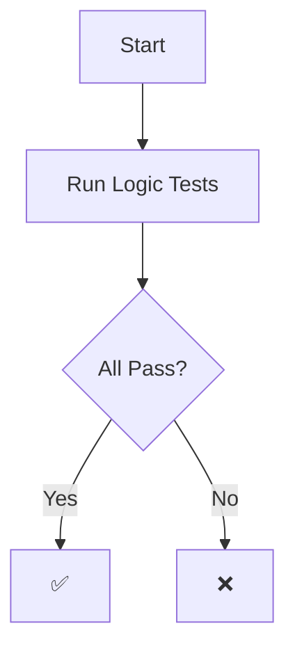

# Test Guide: How Agent Logic Tests Work (Step-by-Step)

## 🎯 What Are We Testing?

We're testing **RAMM agents** - these are like digital workers that handle different parts of an e-commerce system:
- **VALET**: Creates campaigns for brands
- **SHOPI**: Helps shoppers find products
- **PAYME**: Handles payments
- **FOLIO**: Manages user portfolios
- And 10+ more agents...

Each agent needs to:
1. ✅ Communicate correctly with other agents
2. ✅ Change states properly (idle → active → completed)
3. ✅ Handle errors gracefully
4. ✅ Follow security rules

---

## 📚 Step 1: Understanding the Test Structure

### What is a "Test Scenario"?

A test scenario is like a **story** that describes what should happen:

**Example: "Purchase Flow"**
1. Shopper wants to buy a product
2. SHOPI agent recommends it
3. SHOPI calls MARKT (marketplace) to get price
4. SHOPI calls PAYME to authorize payment
5. SHOPI calls FOLIO to mint the PVT token
6. FOLIO mints the token
7. PAYME settles the payment

**The test checks:** Did all these steps happen in the right order?

---

## 🔍 Step 2: How Tests Are Scored

### Scoring System (Like a Test in School)

Each test has **checks** (like questions):
- Each check is worth **points** (1-3 points)
- You get points if the check **passes**
- You lose points if the check **fails**

**Example Check:**
- ✅ "SHOPI → MARKT swap request" (worth 2 points)
  - **Passes if:** Test finds that SHOPI called MARKT
  - **Fails if:** SHOPI never called MARKT

### Final Score Calculation

```
Total Score = (Points Earned / Total Points) × 100%
```

**Example:**
- Total possible points: 24
- Points earned: 20
- Score: 20/24 = 83.3%

### Pass/Fail Thresholds

- **PASS**: Score ≥ 70-85% (depending on test)
- **PARTIAL**: Score 50-70% (some things work, some don't)
- **FAIL**: Score < 50% (major issues)

---

## 🧪 Step 3: How We Determine If Tests Pass or Fail

### The Testing Process (Step-by-Step)

#### Step 3.1: Create Mock Data
**What:** We create fake (but realistic) data
**Why:** We can't use real user data, so we simulate it

**Example Mock Data:**
```python
campaign = {
    "campaign_id": "CAMP-001",
    "product_name": "Limited Edition Jacket",
    "price_usdc": 150.0,
    "total_supply": 5000
}

wallet = {
    "principal": "shopper-principal-001",
    "balance_usdc": 500.0
}
```

#### Step 3.2: Simulate the Scenario
**What:** We "play out" what should happen
**How:** We create a timeline of events

**Example Timeline:**
```
Time 1: SHOPI receives "recommend campaign" command
Time 2: SHOPI calls MARKT (A2A call)
Time 3: SHOPI calls PAYME (A2A call)
Time 4: FOLIO mints PVT (state transition)
Time 5: PAYME settles escrow (state transition)
```

#### Step 3.3: Check Each Expected Event
**What:** We compare what happened vs. what should happen

**Example Check:**
```python
Expected: SHOPI should call MARKT
Actual: Timeline shows "SHOPI → MARKT" call at Time 2
Result: ✅ PASS (2 points earned)
```

**Another Example:**
```python
Expected: FOLIO should transition to ACTIVE state
Actual: Timeline shows "FOLIO → ACTIVE" at Time 4
Result: ✅ PASS (3 points earned)
```

**Failure Example:**
```python
Expected: Event keyword "rejected" should appear
Actual: Timeline has no "rejected" keyword
Result: ❌ FAIL (0 points)
```

#### Step 3.4: Calculate Final Score
**What:** Add up all points and calculate percentage

**Example:**
```
Check 1: SHOPI → MARKT call → ✅ 2 points
Check 2: SHOPI → PAYME call → ✅ 2 points
Check 3: FOLIO mints PVT → ✅ 3 points
Check 4: PAYME settles → ✅ 3 points
Check 5: Event "rejected" → ❌ 0 points

Total: 10 points earned / 12 points possible = 83.3%
Threshold: 85%
Result: ⚠️ PARTIAL (close but not quite)
```

---

## 🎨 Step 4: Visualizing Test Results

### Using Rich (Beautiful Terminal Output)

**What Rich Does:**
- Colors the output (green = pass, red = fail, yellow = partial)
- Creates tables and trees
- Makes results easy to read

**Example Output:**
```
✅ campaign_creation: 14/14 (100.0%)
⚠️ purchase_flow: 20/24 (83.3%)
❌ unauthorized_command: 5/9 (55.6%)
```

### Using Mermaid (Flow Diagrams)

**What Mermaid Does:**
- Creates flowcharts showing test execution
- Shows agent → canister relationships
- Visualizes communication flows

**Example:**


### Using Pydantic (Data Validation)

**What Pydantic Does:**
- Validates that data structures are correct
- Ensures agent inputs/outputs match expected format
- Catches errors early

**Example:**
```python
class AgentEvent(BaseModel):
    agent_code: str  # Must be a string
    kind: EventKind  # Must be one of: COMMAND, A2A_CALL, etc.
    summary: str  # Must be a string
```

If data doesn't match, Pydantic raises an error immediately.

---

## 🏗️ Step 5: Where Do ICP Canisters Fit?

### Understanding the Architecture

**Python Agents (What We Test):**
- These are **models** of how agents should behave
- They run in Python (fast, easy to test)
- They simulate agent logic

**ICP Canisters (Where They Live):**
- Each agent becomes a **canister** on ICP
- Canisters are like "containers" that run on the Internet Computer
- They communicate via **inter-canister calls**

### Mapping: Agent → Canister

**Example:**
```
Python Agent: VALET
    ↓
ICP Canister: valet-canister (on Subnet: Brand Services)
    ↓
Storage: Stable Memory (persistent)
    ↓
Communication: Inter-canister calls (A2A)
```

**Key Assumptions:**
1. **One Agent = One Canister** (usually)
2. **A2A Calls = Inter-Canister Calls** (same thing, different names)
3. **State Storage = Stable Memory** (persistent storage on ICP)
4. **Authentication = ICP_ID** (all calls verified)

### Canister Groups

Agents are grouped by function:
- **Brand Services**: VALET, PORTE, DASHB, PROMO
- **Shopper Services**: SHOPI, DASHC, FOLIO, MIRO
- **Finance Services**: PAYME, DEFIME, PAYOUT
- **Marketplace**: MARKT
- **Redemption**: RIDIM
- **Identity**: ICP_ID

---

## 📊 Step 6: Reading Test Results

### Example Test Output

```
[PASS] campaign_creation
Score: 14/14 (100.0%)
Threshold: 70.0%
  ✓ VALET receives campaign config
  ✓ VALET transitions to ACTIVE
  ✓ VALET → PROMO notification
  ✓ VALET → DASHB state update
  ✓ A2A call VALET → PROMO
  ✓ A2A call VALET → DASHB
  ✓ VALET → active
  ✓ Event keyword 'campaign' found
  ✓ Event keyword 'VALET' found
  ✓ Event keyword 'PROMO' found
```

**How to Read This:**
1. **`[PASS]`**: Test passed (score ≥ threshold)
2. **`Score: 14/14`**: Got all 14 points
3. **`(100.0%)`**: Perfect score
4. **`Threshold: 70.0%`**: Needed 70% to pass
5. **`✓`**: Each check passed

### Partial Pass Example

```
[PARTIAL] purchase_flow
Score: 20/24 (83.3%)
Threshold: 85.0%
  ✓ SHOPI recommends campaign
  ✓ SHOPI → MARKT swap request
  ✗ Event keyword 'rejected' found
    → Not found in timeline
```

**How to Read This:**
1. **`[PARTIAL]`**: Some checks passed, some failed
2. **`Score: 20/24`**: Got 20 out of 24 points
3. **`(83.3%)`**: 83.3% score
4. **`Threshold: 85.0%`**: Needed 85%, got 83.3% → PARTIAL
5. **`✗`**: This check failed
6. **`→ Not found in timeline`**: Why it failed

### Fail Example

```
[FAIL] unauthorized_command
Score: 5/9 (55.6%)
Threshold: 90.0%
  ✓ Auth check performed
  ✗ Event keyword 'rejected' found
    → Not found in timeline
  ✗ A2A call SHOPI → FOLIO
    → Expected call not found in timeline
```

**How to Read This:**
1. **`[FAIL]`**: Test failed (score < threshold)
2. **`Score: 5/9`**: Only got 5 out of 9 points
3. **`(55.6%)`**: 55.6% score
4. **`Threshold: 90.0%`**: Needed 90%, got 55.6% → FAIL
5. **Multiple `✗`**: Several checks failed

---

## 🔧 Step 7: How to Fix Failed Tests

### Understanding Why Tests Fail

**Common Reasons:**
1. **Missing Event**: Expected event didn't happen
   - **Fix**: Add the event to the simulation
   
2. **Wrong Order**: Events happened in wrong sequence
   - **Fix**: Reorder events in simulation
   
3. **Missing A2A Call**: Agent didn't call another agent
   - **Fix**: Add the A2A call to the scenario
   
4. **Wrong State Transition**: Agent didn't change state correctly
   - **Fix**: Add proper state transition

### Example Fix

**Before (Failing):**
```python
# Missing: SHOPI → MARKT call
timeline.add(AgentEvent(
    agent_code="SHOPI",
    kind=EventKind.COMMAND,
    summary="SHOPI recommends campaign",
))
# ❌ Test expects SHOPI → MARKT call, but it's missing
```

**After (Fixed):**
```python
# Added: SHOPI → MARKT call
timeline.add(AgentEvent(
    agent_code="SHOPI",
    kind=EventKind.A2A_CALL,
    summary="SHOPI requests swap quote from MARKT",
    details={"target": "MARKT"},
))
# ✅ Test now finds the expected call
```

---

## 🎓 Step 8: Conclusion - How We Know Tests Are Correct

### The Verification Process

1. **Define Expected Behavior**: What should happen?
2. **Create Mock Data**: Realistic test data
3. **Simulate Scenario**: Play out the events
4. **Check Each Step**: Compare actual vs. expected
5. **Calculate Score**: Points earned / total points
6. **Compare to Threshold**: Score ≥ threshold = PASS

### Confidence Levels

- **100% Score**: Perfect - everything worked as expected
- **85-99% Score**: Very good - minor issues, mostly correct
- **70-84% Score**: Good - some issues, but core functionality works
- **50-69% Score**: Partial - significant issues, needs work
- **<50% Score**: Fail - major problems, needs significant fixes

### Why This Approach Works

1. **Deterministic**: Same input = same output (reproducible)
2. **Comprehensive**: Tests many scenarios (16 logic + 11 business)
3. **Visual**: Easy to see what passed/failed
4. **Fast**: Runs in seconds (not hours)
5. **Safe**: Uses mock data (no real systems affected)

---

## 📝 Quick Reference

### Running Tests
```bash
# All logic tests
python -m app.test_logic

# All business logic tests
python -m app.business_logic

# Generate report
python -m app.report_generator
```

### Understanding Results
- **✅ PASS**: Score ≥ threshold, all critical checks passed
- **⚠️ PARTIAL**: Score 50-70%, some checks failed
- **❌ FAIL**: Score < 50%, major issues

### Key Files
- `app/test_logic.py`: Logic test scenarios
- `app/business_logic.py`: Calculation tests
- `app/validate.py`: Graph integrity checks
- `app/nanda_validator.py`: NANDA compliance checks

---

## 🎯 Summary

**In Simple Terms:**
1. We create fake scenarios (like "someone buys a product")
2. We simulate what should happen step-by-step
3. We check if each step happened correctly
4. We give points for each correct step
5. We calculate a score (like a test grade)
6. If score ≥ threshold → PASS, else → FAIL

**The tests are correct if:**
- They test realistic scenarios
- They check all important steps
- They catch errors and security issues
- They give clear pass/fail results

This is how we ensure the RAMM agent system works correctly before deploying to ICP! 🚀
